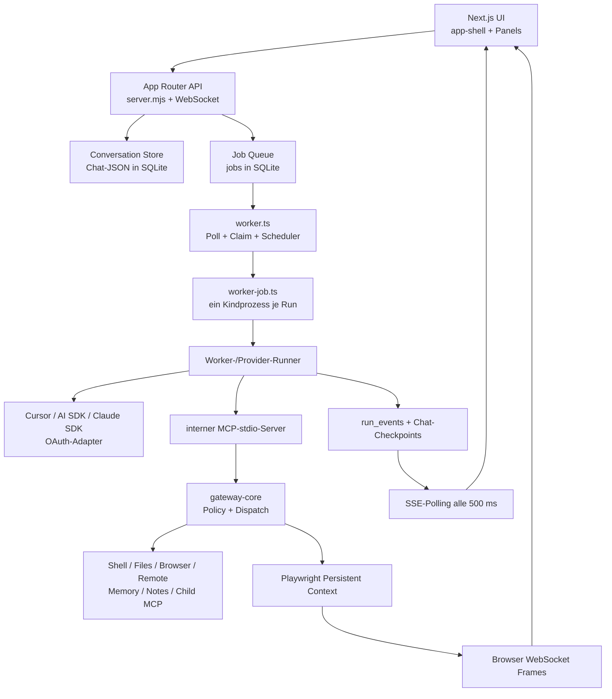
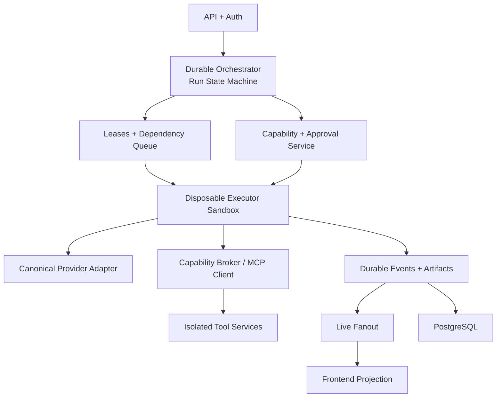

# Metis AI – vollständiger Architektur- und Sicherheits-Audit

> **Status:** Snapshot **21 Aug 2026**. Keine Live-Bugliste. Offene Punkte und Fixes danach: [PRODUCTION-AUDIT.md](./PRODUCTION-AUDIT.md) und [BUG_PRIORITY.md](./BUG_PRIORITY.md).

**Stand:** 2026-08-21  
**Repository:** `/home/samuel/metis-ai`  
**Branch / Commit:** `stable/overall` / `5380da79244247a033dde1cc95585ab2ff735189`  
**Arbeitsbaum vor dem Audit:** 14 Commits vor `origin/master`; bereits vorhandene Änderungen in `lib/plan-usage.ts`, `lib/usage-display.ts`, `lib/worker-runner.ts`, `tests/live-agent-events.test.ts` und `tests/usage-display.test.ts`. Diese Änderungen wurden nicht überschrieben.  
**Auditmodus:** Code-first, read-only für Produktionszustand und Datenbank; keine Dienste gestoppt, keine Produktionsdaten geändert, keine funktionalen Umbauten vorgenommen.

## 0. Management Summary

Metis ist funktional deutlich weiter als ein einfacher Chat-Prototyp: Es besitzt eine Next.js-Oberfläche, einen eigenen HTTP/WebSocket-Server, eine persistente Job-Queue, getrennte Worker-Prozesse, mehrere Providerpfade, MCP, Browserautomation, Subagents, Automationen, Memories, Notes und Remote Clients.

Die Plattform ist aber noch keine robuste, eindeutig orchestrierte Agent-Runtime. Das Kernproblem ist nicht ein einzelner Bug, sondern die Kombination aus:

1. **mehreren überlappenden State Machines** (Job-Spalte, Job-JSON, Chat-JSON, Run-Events, Provider-Session, Browser-Session, Subagent-Metadaten und React-State);
2. **einem globalen synchronen SQLite-Writer** bei bis zu 25 parallelen Worker-Kindprozessen;
3. **Voll-Blob-Rewrites** für Chats und Jobs während Streams und Tool-Checkpoints;
4. **zu breiter Tool-Exposition** statt vorab kompilierter, kleiner Capability-Manifeste;
5. **fehlender starker Sandbox-Grenze** für lokale Shell-/Tool-Ausführung;
6. **inkonsistenten Provider-Versprechen**: Registry und „verified capabilities“ beschreiben teilweise Agent-SDK-Fähigkeiten, die der tatsächlich gewählte Laufpfad nicht nutzt;
7. **drei unmittelbar sicherheitsrelevanten Implementierungsfehlern**:
   - Modellseitig setzbares `approved=true` beim Remote-Terminal,
   - SSRF über nicht erneut validierte Link-Preview-Redirects,
   - Legacy-Header-Authentifizierung erlaubt mit dem globalen Passwort die Wahl eines existierenden Benutzers.

**Empfehlung:** kein Big-Bang-Rewrite und nicht zuerst PostgreSQL einführen. Zuerst die P0-Sicherheitsgrenzen schließen, danach eine kanonische Run-State-Machine und ein persistentes Eventmodell etablieren. Erst anschließend Queue, Datenhaltung und Provideradapter migrieren.

## 1. Umfang, Methode und Grenzen

Untersucht wurden die gesamte relevante Quellstruktur unter `app`, `components`, `lib`, `packages`, `scripts`, `tests`, `deploy`, `worker.ts`, `worker-job.ts`, `server.mjs`, Container-/systemd-Konfiguration und die read-only Produktionsdatenbank.

Größenordnung:

| Bereich | Dateien / Beobachtung |
|---|---:|
| Produktiver TypeScript/JavaScript-Code | ca. 59.142 Zeilen |
| `app` | 83 Dateien |
| `components` | 50 Dateien |
| `lib` | 95 Dateien |
| Tests | 41 `.test.ts`-Dateien |
| Größte UI-Datei | `components/app-shell.tsx`, 10.434 Zeilen |
| Größte Runtime-Dateien | `gateway-core.mjs`, `worker-runner.ts`, `providers/runner.ts` |

Nicht durchgeführt wurden echte kostenpflichtige 20-Provider-Runs, destruktive Browser-/Remote-Client-Tests und ein Live-Worker-Crash in Produktion. Solche Tests gehören in eine isolierte Testumgebung mit Fake-Provider und Fake-Gateway.

## 2. Tatsächlich implementierte Architektur

### 2.1 Frontend

Die UI ist überwiegend in einem 10.434-zeiligen Client-Component-Monolithen implementiert. Zahlreiche unabhängige `useState`-, `useEffect`- und `useCallback`-Pfade verwalten Chatliste, aktiven Chat, optimistische Messages, Run-Status, SSE, Browser, Queue, Modelwechsel und Subagents. Es gibt keinen zentralen Reducer oder UI-State-Automaten.

Zusätzlich zum SSE-Stream pollt die UI:

- Chatliste ungefähr alle 10 Sekunden,
- laufende Hintergrund-Chats ungefähr alle 2 Sekunden,
- inaktive Chats ungefähr alle 15 Sekunden,
- Status ungefähr alle 30 Sekunden,
- Remote Clients ungefähr alle 60 Sekunden.

Das macht die UI robust gegen verlorene Events, erzeugt aber redundante Last und verschleiert State-Desynchronisation statt sie zu verhindern.

### 2.2 API und Conversation Layer

`POST /api/chat` führt die wichtigste atomare Grenze korrekt aus: Message-ID-Idempotenz, erneute Active-Run-Prüfung, User-Message und Job-Insert liegen in einer `BEGIN IMMEDIATE`-Transaktion. Uploads werden allerdings vorher gespeichert und können bei 409/Crash verwaisen.

Mit `POST /api/runs` existiert ein überlappender zweiter Startpfad mit abweichendem Funktionsumfang. Das erzeugt langfristig Drift bei Titeln, Referenzen, Messages, Idempotenz und Statusprojektionen.

Chats sind große JSON-Aggregate in `chats.data`. Seiten, Metadatenänderungen, Streaming-Checkpoints und Tool-Ergebnisse lesen/parsen bzw. schreiben das gesamte Aggregat. Messages, Tool Calls und Attachments sind nicht normalisiert.

Konkreter Privacy-Bug: `listChatsForUser` prüft `item.incognito`, selektiert `incognito` aber in keiner der beiden SQL-Projektionen. Inkognito-Chats können deshalb in der normalen Chatliste erscheinen.

### 2.3 Scheduler und Worker

`worker.ts` pollt standardmäßig alle 500 ms. `claimNextJob` selektiert und aktualisiert atomar in `BEGIN IMMEDIATE`. Die Standardkonkurrenz beträgt 25. Jeder Job wird in einem eigenen Node/`tsx`-Kindprozess ausgeführt.

Positive Eigenschaften:

- atomarer Claim;
- Interactive-vor-Background-Priorität;
- Message-ID-Idempotenz;
- Heartbeat;
- Startup-Recovery für stale Runs;
- maximal zwei Retry-Versuche nach Kindprozessfehlern;
- Abbruchprüfung;
- getrennte Kindprozesse begrenzen Heap-Leaks pro Run.

Schwächen:

- Lease ist nur `claimedAt`, ohne Lease-Owner/Fencing Token/Expiry;
- stale Recovery läuft primär beim Workerstart;
- Retry rekonstruiert einen Prompt, aber keine exactly-once Tool-Receipts;
- ein Crash nach externer Side Effect kann dieselbe Aktion erneut ausführen;
- der Worker wartet beim eigenen Shutdown auf Kinder, signalisiert sie aber nicht selbst;
- 25 Prozesse laden SDK, DB und MCP gleichzeitig und konkurrieren um dieselbe SQLite-Datei.

### 2.4 Agent Runtime und Lifecycle

Ein Run entsteht über API → Chat/Job-Transaktion → Worker-Claim → Kindprozess → Runner. Context wird aus Chatverlauf, Modus, Provider/Model, Memories, Notes, Workspaces, Referenzen, Browserstatus, Toolregeln und optional Automation-/Subagent-Kontext zusammengesetzt.

Es fehlt ein persistierter, versionierter `RunContextSnapshot`. Ein Resume kann daher andere Mode-/Tool-/Provider-Regeln sehen als der ursprüngliche Versuch.

Der Run-State ist parallel gespeichert in:

- `jobs.status`,
- `jobs.data.status`,
- `chats.data.runStatus`,
- `run_events`,
- Pending Questions,
- Provider-Session-Dateien,
- React-State und lokalen Caches.

Es gibt keinen einzigen Transition-Owner und keine compare-and-set-basierte kanonische Zustandsmaschine.

**Cursor-Pfad:** `agent.send` wird gegen einen 90-Sekunden-Starttimeout geraced. Wenn der Timeout gewinnt, ist nicht nachgewiesen, dass der darunterliegende Send-Aufruf beendet wird. Der Inaktivitätsmonitor emittiert Status, beendet aber den Run nicht; der äußere Kindprozess-Hard-Timeout bleibt die letzte Grenze.

**Alternative Provider:** Der Vercel-AI-SDK-Loop besitzt Schrittbudget, Context-Compaction, MCP-Tools und Text-/JSON-Fallback. Explizite einheitliche Retry-/Backoff-/Rate-Limit-Semantik fehlt. Netzwerk- und Providerfehler enden je nach Adapter unterschiedlich.

**Cancellation:** Die Kindruntime pollt ungefähr alle 250 ms und versucht Provider-/Abort-Operationen. Ein durchgehendes AbortSignal von API über Queue, Provider, Tool, Browser und Remote Client existiert nicht. Späte Events können daher mit Terminalzuständen konkurrieren.

### 2.5 Streaming

Provider-Deltas werden zu `run_events` und periodischen Chat-Checkpoints. `/api/runs` liest pro SSE-Verbindung alle 500 ms aus SQLite. Events werden bei Busy nach wenigen Versuchen verworfen; die Chatmessage gilt als Fallback-Quelle. Global werden nur 10.000 Run-Events gehalten.

Das ist ein brauchbarer Live-Feed, aber kein vollständiges, per Run replaybares Auditlog. Bei mehreren Tabs und 20 Runs vervielfacht sich das DB-Polling.

### 2.6 Subagents

Subagents sind eigene Chats und Jobs mit Parent-Metadaten. Begrenzungen: Tiefe 4, bis zu 8 Kinder. Positive Seite: getrennte Transkripte und persistente Jobs.

Risiken:

- synchrones `wait=true` hält einen HTTP-/Tool-Aufruf mit 400-ms-Polling bis zu 30 Minuten offen;
- Parent und Kinder teilen denselben Worker-Pool; verschachtelte Waits können Slots erschöpfen;
- Deduplizierung verwendet Parent-Job + Titel, nicht den vollständigen Taskhash;
- genau-einmalige Reviewer-Erzeugung ist nicht per Unique Constraint abgesichert;
- parallele Kinder haben kein Workspace-Lock-/Merge-Protokoll;
- Resultate werden überwiegend als Prompttext synthetisiert statt als typisierte Artefakte.

### 2.7 Automationen

Der Scheduler läuft im Worker-Poll-Loop. Due-Claims sind transaktional und berücksichtigen stale Claims sowie aktive Runs. Die visualisierte Automation-Graphstruktur ist jedoch Metadaten/UI, keine ausgeführte allgemeine Workflow-Graphengine.

Die gespeicherte Zeitzone wird bei der eigentlichen Zeitberechnung nicht konsistent als Kalenderzeitzone verwendet; Intervall- und Monthly-Berechnung sind weitgehend UTC-basiert. Das führt besonders bei DST und „Monatstag um lokale Uhrzeit“ zu fachlich falschen Triggern.

### 2.8 Browser Automation

Playwright nutzt pro Owner persistente Browserkontexte und pro Chat Sessions/Tabs. Aktionen sind je Owner/Chat serialisiert, besitzen Queue- und Execution-Timeouts, Zombie-Kontexte werden erkannt. Jede Page installiert einen Request-Guard; Redirects und Subresources werden damit gegen private IPs geprüft. Das ist deutlich besser als nur die Navigations-URL zu prüfen.

Risiken:

- Browserprofile und Cookies liegen persistent auf demselben Host wie Agent/Tools;
- gleiche Owner-Kontexte teilen Credentials über Chats;
- DNS-Erlaubnis wird 60 Sekunden gecacht (DNS-Rebinding-Restrestrisiko);
- Screenshots/WebSocket-Frames und große Snapshots sind speicher- und bandbreitenintensiv;
- Browser ist kein separater Sicherheitsdienst/Sandbox.

### 2.9 Deployment

Es existieren drei logische Prozesse: Web-App, Worker und MCP-Gateway; Docker Compose und systemd-Templates sind vorhanden. Der App-Server integriert zusätzlich WebSockets. Zum Auditzeitpunkt waren App und Worker aktiv, der eigenständige `mcp-universal`-Dienst inaktiv; interne Runs können dennoch den per Run gestarteten stdio-Gateway verwenden.

Memory-Limits: App 2 GiB, Worker 6 GiB, MCP 1 GiB. Der Worker darf 500 % CPU. App, Worker und MCP teilen im Containerdesign dieselbe SQLite-Datei.

Die Source-Directory enthält `.next`, `.next-a`, `.next-b`, `node_modules` und rund 1,3 GiB `data`. Das vergrößert Build-Kontext, Backup und Fehlerrisiko.

## 3. Tool- und MCP-Audit

### 3.1 Implementierung

Der interne MCP-Server wird pro Run per stdio gestartet und trägt Owner-, Chat-, Job-, Mode-, Incognito- und Workspace-Kontext. Child-MCP-Server werden entdeckt und über einen Registry/Broker-Pfad aufgerufen. Tool-Timeout liegt typischerweise bei 300 Sekunden.

Gute Kontrollen:

- POSIX-Useridentität und Root-Verbot ohne explizite Konfiguration;
- Workspace-Containment für dedizierte File-Tools;
- Mode-, Automation-, Incognito- und Remote-Transport-Checks zur Call-Zeit;
- private-IP-Schutz im Browser;
- Child-MCPs aus öffentlicher Registry laufen laut Code in restriktiven Dockercontainern.

Kritische Architekturdefizite:

1. **ListTools liefert den gesamten Kernkatalog.** Nicht erlaubte Tools werden erst beim Aufruf abgewiesen. Das verschwendet Context und vergrößert Prompt-Injection-/Fehlaufruf-Fläche.
2. **Toolkategorien werden teilweise aus Namen per Regex abgeleitet.** Unbekannte Tools fallen in grobe Kategorien; semantische Autorisierung darf nicht vom Namen abhängen.
3. **Lokale Shell ist keine Sandbox.** Das CWD wird begrenzt, aber der Prozess besitzt weiterhin alle Rechte des OS-Benutzers und dessen Netzwerkzugriff.
4. **Textueller XML/JSON-Fallback ist ein zweiter Aktionskanal.** Er kann Modelltext ausführen, wenn native Tool Calls fehlen.
5. **Timeout ohne sichere Unterbrechung.** Ein lebender, aber hängender MCP-Prozess wird nicht in allen Fällen zuverlässig abgebrochen und entsorgt.
6. **Tool-Audit kann Geheimnisse enthalten.** Remote-Audit redigiert nur flach anhand von Keynamen; Commands oder verschachtelte Objekte können Tokens enthalten.

### 3.2 Ziel: Capability Architecture

Vor jedem Providerstart muss ein unveränderliches, signiertes/gehastes `CapabilityManifest` erzeugt werden. Nur dessen Tools werden dem Modell gezeigt; derselbe Manifest-Hash wird am Gateway erneut geprüft.

| Agentklasse | Sichtbare Capabilities |
|---|---|
| Coding Read | repo.search, fs.read, git.diff |
| Coding Write | Coding Read + fs.patch, git.branch, tests.run |
| Research | web.search, web.open, papers.read, notes.write |
| Browser Read | browser.navigate, snapshot, extract |
| Browser Act | Browser Read + click/type/upload, mit Approval-Regeln |
| Reviewer | diff.read, tests.read/run, findings.write |
| Automation | ausschließlich vordefinierte, non-interaktive Capabilities |
| Remote | exakter Client + exakte Aktion + Approval-Receipt |

Jeder Tool Call benötigt: `run_id`, `attempt_id`, `tool_call_id`, `owner_id`, `workspace_id`, `capability`, `policy_version`, `idempotency_key`, Deadline und AbortSignal.

## 4. Provider-Layer-Audit

### 4.1 Tatsächliche Capability-Matrix

„MCP“ bedeutet hier meist: Metis stellt MCP-Tools über seinen eigenen Loop bereit, nicht dass der Upstream-Provider MCP nativ beherrscht.

| Provider | Tatsächlicher Hauptpfad | Streaming | Tools/MCP | OAuth | Inkonsistenz |
|---|---|---:|---:|---:|---|
| Cursor | Cursor Agent SDK | ja | native + MCP | nein, API-Key | echter Agentpfad |
| OpenAI | Vercel AI SDK | ja | Metis-Tools | nein | kein nativer Agentlauf |
| Anthropic | Vercel AI SDK | ja | Metis-Tools | nein | nicht Claude Code |
| Google | Vercel AI SDK | ja | Metis-Tools | nein | Modellfähigkeit wird pauschal angenommen |
| xAI | Vercel AI SDK | ja | Metis-Tools + Websuche | nein | adapterabhängig |
| OpenRouter | AI SDK/OpenAI-kompatibel | ja | Metis-Tools | nein | Modellfähigkeiten variieren stark |
| Ollama | OpenAI-kompatibel | ja | best effort | lokal/API-Key | Tools/Vision nicht garantiert |
| Compatible | OpenAI-kompatibel | ja | best effort | optional | Discovery/Tools nicht garantiert |
| Codex | API-Key → AI SDK; OAuth → OAuth-AI-SDK | ja | Metis-Tools | ja | deklarierter Codex-SDK-Pfad ist im Dispatcher nicht der Normalpfad; `runCodex` ist praktisch unerreichbar |
| Claude Code | je nach Credential OAuth-AI-SDK bzw. Agent-SDK-Helfer | ja | Metis/SDK | ja | Semantik hängt am Credentialformat |
| Antigravity | OAuth-AI-SDK | ja | Metis-Tools | ja | deklarierter offizieller `agy`-CLI-Agentpfad ist im Dispatcher nicht aktiv; `runAntigravity` ist praktisch unerreichbar |

Die Registry markiert generisch Streaming, Tools, Vision, MCP und bei Agentprovidern Browser/Skills/Subagents. `audit:capabilities` prüft jedoch nur Deklarationen und nennt sie anschließend `verified`; es führt **keinen** externen Model-, Stream-, Tool-, Cancel- oder Resume-Probe aus. Die Bezeichnung ist irreführend.

### 4.2 Fehlende Normalisierung

Es fehlt ein einheitlicher `ProviderAdapter` mit:

- `probeCapabilities()` plus Evidenz/Timestamp,
- `start(contextSnapshot)`,
- kanonischem Eventstream,
- `cancel(deadline)`,
- `resume(checkpoint)`,
- Usage/Rate-Limit-Metadaten,
- klassifizierten Fehlern,
- Retry-Policy mit Jitter und Idempotenz.

Heute unterscheiden sich Provider bei Eventformen, Toolresultaten, Reasoning, Timeouts, OAuth-Refresh, Contextgrenzen, Wiederaufnahme und Fehlertexten.

## 5. Datenbank- und State-Audit

### 5.1 Ist-Zustand

SQLite läuft mit WAL, `synchronous=NORMAL`, `busy_timeout=10000`, Foreign Keys, 32-MiB-Cache und Auto-Checkpoint. `transaction()` nutzt `BEGIN IMMEDIATE` und bis zu acht Wiederholungen. Backoff erfolgt mit `Atomics.wait` und blockiert damit den jeweiligen Node-Eventloop.

Produktionssnapshot:

| Kennzahl | Wert |
|---|---:|
| Datenbank | ca. 171,6 MB |
| WAL | ca. 6,4 MB |
| Chats | 177 |
| Jobs | 402 |
| Run-Events | exakt 10.000 (globales Limit erreicht) |
| Jobs letzte 24 h | 141 |
| Chat-Blob Median | ca. 180.836 Byte |
| Chat-Blob Maximum | ca. 2.580.829 Byte |
| Chats > 1 MiB | 6 |
| Summe Chat-JSON | ca. 42,3 MiB |
| erfolgreiche Run-Dauer Ø | ca. 241 s |
| erfolgreiche Run-Dauer max. | ca. 1.838 s |

### 5.2 Warum „database locked“ entsteht

Die Ursache ist kein fehlendes einzelnes `busy_timeout`, sondern Write-Amplification:

1. bis zu 25 Jobprozesse;
2. App, Worker, Kindprozesse und Gateway mit eigenen `DatabaseSync`-Connections;
3. global serialisierendes `BEGIN IMMEDIATE`;
4. Job-Read-Modify-Write auf vollständigem JSON;
5. Tool-Checkpoints schreiben den vollständigen Chat unmittelbar;
6. Text-Checkpoints ungefähr alle 0,5–1,5 Sekunden;
7. SSE/Status/Heartbeat/Remote-Telemetrie und Event-Cleanup;
8. globale Event-Retention-Deletes;
9. JSON-Ausdrücke in Queue- und Chatqueries.

Historische Backupnamen (`pre-lock-fix`, `pre-tool-snapshot-migration`) und mindestens ein persistierter Jobfehler `database is locked` bestätigen, dass dies ein reales und nicht nur theoretisches Problem ist.

### 5.3 Datenmodellprobleme

- Status doppelt in relationaler Spalte und JSON;
- Messages/Parts/Tools im Chatblob;
- Active-Run-Invariante nur anwendungsseitig, kein partieller Unique Index;
- Share-Lookup scannt Chatblobs statt indexierter Share-ID;
- Chatsuche lädt alle Chatblobs und Messages in JS, kein FTS;
- Run-Events global statt per Run limitiert;
- Owner ist an mehreren Stellen nullable und Queries behandeln `user_id IS NULL` als Legacy-Wildcard;
- in-memory Caches sind pro Prozess und werden nicht über Prozesse invalidiert.

### 5.4 Zielarchitektur

Kurzfristig kann SQLite bleiben, wenn:

- Hot Fields normalisiert werden;
- nur ein Writer-Pfad hochfrequente Events schreibt;
- Transaktionen kurz und non-blocking werden;
- Chat-Stream nicht den Vollblob überschreibt;
- Lastmetriken SLOs einhalten.

Mittelfristig:

- **PostgreSQL:** Users, Chats, Messages, Runs, Attempts, Tool Calls, Approvals, Events;
- **Redis oder durable Queue:** Leases, Scheduling, Rate Limits, Live-Fanout; nicht als kanonischer Run-State;
- **Object Storage:** Uploads, Screenshots, große Toolresultate, Transkripte;
- **Vector/FTS:** nur abgeleitete Suche/Memory, niemals Source of Truth;
- **Event Bus:** erst bei mehreren Konsumenten/Services; Outbox Pattern aus PostgreSQL;
- **OpenTelemetry:** Traces, Metriken und strukturierte Logs.

## 6. Sicherheitsanalyse

| ID | Problem | Impact | Wahrscheinlichkeit | Priorität |
|---|---|---|---|---|
| SEC-01 | `remote_client_terminal.approved` ist Modellargument; Gateway übernimmt es als Approval | Remote Shell ohne echte menschliche Zustimmung | hoch bei Prompt Injection | **P0** |
| SEC-02 | Link Preview validiert nur Start-DNS; `fetch` folgt Redirects ohne Revalidierung | SSRF auf private/Metadata-Netze | mittel-hoch | **P0** |
| SEC-03 | Legacy `x-chat-password` + frei wählbarer `x-chat-username` | Benutzer-Impersonation mit globalem Passwort | mittel, konfigurationsabhängig | **P0** |
| SEC-04 | Host-Shell ohne disposable Sandbox | Hostzugriff/Exfiltration | hoch | **P0** |
| SEC-05 | nullable Owner + `user_id IS NULL`-Wildcard | Cross-Tenant-Zugriff bei Legacydaten | mittel | **P0** |
| SEC-06 | kompletter Toolkatalog vorab sichtbar | Prompt-Injection-Fläche und Fehlaufrufe | hoch | **P0** |
| SEC-07 | textueller XML/JSON-Toolfallback | unklare Provenienz/doppelte Side Effects | mittel | P1 |
| SEC-08 | Inkognito-Feld fehlt in Chatlisten-SQL | Privacy-Leak in normaler Navigation | hoch für Inkognito-Nutzung | P1 |
| SEC-09 | Rate Limit in-memory/pro Prozess; Forwarded-IP ungeprüft | Login-Limit umgehbar/uneinheitlich | mittel | P1 |
| SEC-10 | Remote-/MCP-Audit redigiert nur flach | Secrets in Commands/verschachtelten Args | mittel | P1 |
| SEC-11 | Browserprofile/Cookies auf Agenthost | Credential-Diebstahl bei Sandbox-Ausbruch | mittel | P1 |
| SEC-12 | gleiche Bearer-Credential für interne privilegierte APIs | großer Blast Radius | mittel | P1 |
| SEC-13 | keine persistente Approval-Entität/Receipt | Replay und falsche Bindung | hoch | **P0** |
| SEC-14 | globale Eventlöschung / Busy-Drops | forensische Lücken | hoch | P1 |

Approval darf nie ein boolesches Toolargument sein. Es muss eine serverseitige Entität mit Nutzer, Tool-Call-Hash, Argument-Hash, Ablaufzeit, einmaliger Consumption und Audittrail sein.

## 7. Performanceanalyse der kritischen User Journeys

| Journey | Aktuelle Hauptkosten | Ziel |
|---|---|---|
| Chat öffnen | JSON-Extraktion/-Parsing, mehrere Fetches, UI-Monolith, Polling | normalisierte Message-Pages, ein Snapshot, Query-Cache |
| Nachricht senden | Voll-Chat-Write + `BEGIN IMMEDIATE` + Queuezählungen | kurzer Insert + Outbox, DB-Unique-Idempotenz |
| Agent starten | Kindprozess, SDK-Load, MCP-Start, großer Prompt/Toolkatalog | warmer Executor-Pool oder isolierte Sandbox mit Cache; kleines Manifest |
| Tool ausführen | MCP JSON-RPC, 300-s Timeout, Voll-Chat-Checkpoint | Deadline/Abort, typed receipt, inkrementeller Event/Artifact-Write |
| Subagent starten | eigener Chat/Job/Prozess; HTTP-Wait | dependency-aware scheduler, strukturierte Artifacts, keine gehaltene HTTP-Anfrage |
| Stream verfolgen | 500-ms-DB-Poll pro SSE-Verbindung + Zusatzpolling | Push/Fanout, durable cursor + best-effort live channel |

Weitere Hotspots:

- `listChatsForUser`: JSON-Felder pro Row;
- `searchChatsForUser`: O(Chats × Messages) in JS;
- Share-Lookup: Full Scan;
- Models-Endpunkt: initiale Discovery mehrerer Provider kann den ersten Load blockieren;
- `app-shell.tsx`: große Re-Render- und Stale-Closure-Fläche;
- Browserframes bis 30 fps, Backpressure erst bei großem Buffer.

## 8. Vergleich mit modernen Systemen

Öffentliche Primärquellen zeigen wiederkehrende Muster:

1. **Orchestrator und Executor trennen.** Ein langlebiger Orchestrator hält Zustände, Leases, Approvals und Abhängigkeiten; disposable Executor/Sandboxes führen riskante Aktionen aus.
2. **Explizite State Machines und Checkpoints.** LangGraph persistiert State an definierten Grenzen und modelliert Interrupt/Resume als ersten Klasse.
3. **Isolation pro Run.** OpenAI Codex und Cursor Cloud Agents beschreiben isolierte Container/VMs; dies begrenzt Side Effects und macht parallele Runs reproduzierbarer.
4. **Least Privilege.** Claude Code und Cursor unterscheiden Lese-, Schreib- und Terminalrechte; sensible Aktionen benötigen echte Approval-Grenzen.
5. **Spezialisierte Agenten.** OpenAI Handoffs/Agents-as-tools, Claude-Code-Subagents und Devin-Subagents halten Context und Tools task-spezifisch.
6. **ACI statt Toolmenge.** SWE-agent zeigt, dass eine kleine, gut gestaltete Agent-Computer-Schnittstelle mehr bringt als unstrukturierte Universaltools.
7. **Observability und Evaluations.** Runs müssen als Trajectory aus Modell-, Tool-, Approval- und State-Events nachvollziehbar sein.
8. **MCP-Identität und Authorization.** MCP empfiehlt OAuth-basierte, user-/resource-scoped Authorization für HTTP-Server; ein globaler Gateway-Bearer ist kein Enterprise-Endzustand.

Warum Planner/Executor/Reviewer? Nicht um immer drei Modelle aufzurufen, sondern um Verantwortungen und Beweise zu trennen: Planner erzeugt begrenzte Schritte, Executor besitzt nur die nötigen Capabilities, Reviewer prüft Diff/Tests/Policy und darf nicht dieselben unkontrollierten Side Effects wiederholen.

## 9. Zielarchitektur

Kanonische Entitäten:

- `Run`
- `Attempt`
- `Lease`
- `ContextSnapshot`
- `CapabilityManifest`
- `ToolCall`
- `ToolResult`
- `ApprovalRequest/Decision`
- `RunEvent(seq)`
- `Artifact`
- `ChildDependency`

Legale Zustände beispielsweise:
`queued → leased → running → waiting_approval|waiting_user|cancelling → completed|failed|cancelled|interrupted`.
Jede Transition ist compare-and-set, versioniert und idempotent. Chat-Status ist nur eine Projektion.

## 10. Findings nach Schweregrad

### P0 – vor breiter autonomer/mehrbenutzerfähiger Nutzung

- SEC-01 Remote-Terminal-Selbstapproval entfernen.
- SEC-02 Redirect-sicheren Fetch/SSRF-Guard einführen.
- SEC-03 Legacy-Header-Impersonation entfernen.
- SEC-04 disposable Sandbox + Egress Policy.
- SEC-05 Owner NOT NULL / keine Null-Wildcards.
- SEC-06 vorab gefiltertes CapabilityManifest.
- SEC-13 persistente, gebundene Approval-Receipts.

### P1 – Zuverlässigkeit und Operability

- eine kanonische Run-State-Machine;
- durable per-Run Events getrennt von Live-Events;
- Ende-zu-Ende-Cancellation;
- Provideradapter und echte Capability-Probes;
- DB-Write-Amplification reduzieren;
- Subagent-Dependency-/Workspace-Modell;
- Inkognito-Listenbug;
- geteiltes Rate Limiting;
- Release Gates und sauberer Buildkontext;
- UI-State in Domains/Reducer/Query Layer zerlegen.

### P2 – Skalierung und Produktqualität

- Messages/Tools/Attachments normalisieren;
- Postgres/Queue/Object Storage nach Messwerten migrieren;
- Context Compiler mit Budgets und Snapshot-Hash;
- FTS/Vector Retrieval als abgeleitete Schicht;
- allgemeine Automation-Graphengine;
- kosten-/qualitätsbasierte Modellwahl;
- OpenTelemetry, Replay und Agent-Evaluation.

## 11. Konkrete Codeänderungen

| Bereich | Konkrete Änderung |
|---|---|
| `gateway-core.mjs` | `approved` aus Toolschemas entfernen; serverseitiges Approval-Receipt verlangen; ListTools nach Manifest filtern |
| `remote-client-gateway.ts` | Approval-ID + Args-Hash prüfen/atomar konsumieren; tiefe Secret-Redaction |
| `link-preview/route.ts` | `redirect: "manual"`; jeden Hop (Schema, Host, DNS/IP) validieren; Responsegrößenlimit streamend |
| `auth.ts` | Legacy-Headerpfad abschalten oder fest auf einen Migrationsaccount binden; kein Username-Override |
| `db-store.ts` | `incognito` selektieren/SQL-seitig filtern; Share-ID/index; Messages separat |
| `db-jobs.ts` | typed Columns, CAS-Transitions, Lease Owner/Fencing, partieller Unique Index, kein Full-JSON-Update |
| `sqlite.ts` | kein `Atomics.wait` im Requestpfad; Lockmetriken; kurze Transaktionen |
| `runs/route.ts`, `chat/route.ts` | einen gemeinsamen Run-Service verwenden |
| `providers/runner.ts` | tote/unreachable Adapter entfernen oder korrekt dispatchen; kanonische Events/Errors/Retry |
| `capability-audit.ts` | „declared“ statt „verified“; optionale echte Probe-Suite |
| `worker.ts` | Lease Renewal/Fencing; Ressourcenklassen; Child-Dependency-Scheduling |
| `worker-runner.ts` | ContextSnapshot, Eventappend statt Chat-Vollwrite, Tool-Receipts |
| `app-shell.tsx` | Domains extrahieren: chat store, run store, browser store, composer; SSE als Primärquelle |
| Deployment | runtime data außerhalb Repo; `.next*` ausschließen; pinned Dependencies; Sandbox Executor |

## 12. Test- und Fault-Injection-Plan

### 12.1 Architekturtests

- alle Run-Transitions, verbotene Übergänge, terminale Idempotenz;
- DB-Constraint: höchstens ein aktiver Run pro Chat;
- Owner-Negativtests für jede Query/Route;
- Capability-Manifest-Gleichheit zwischen Provider und Gateway;
- Approval kann nur durch passenden User und exakt einmal konsumiert werden.

### 12.2 Integrations-/Lifecycle-Tests

- enqueue → claim → context → stream → tool → result → finish;
- Cancel vor Claim, im Providerstream, während MCP, Browser und Child;
- Resume nach Crash an jeder Boundary;
- Provider liefert späte Events nach Cancel;
- Tool Side Effect passiert, Worker crasht vor Receipt;
- SSE-Reconnect mit Cursor und vollständigem Replay.

### 12.3 Provider-Contract-Tests

Für jeden Adapter: Stream, Tool Call, Tool Error, 429/Retry-After, Timeout, Netzwerkabbruch, Cancel, Resume, Usage, Context Overflow, ungültiges OAuth Refresh. Echte Provider-Smokes separat, limitiert und ohne Privilegien.

### 12.4 Securitytests

- SSRF direkt, Redirect, DNS-Rebinding, IPv4/IPv6/encoded IP;
- Prompt Injection versucht Shell/Remote/Memory-Eskalation;
- Modell setzt `approved=true`;
- Cross-Tenant Chat/Job/Event/Browser/Attachment;
- Command enthält Token in verschachtelten Args;
- Workspace Symlink/TOCTOU;
- MCP-Tool mit täuschendem Namen.

### 12.5 Stress/Fault Matrix

In temporärer DB und Fake-Executors:

- 20 parallele Chats;
- 20 gleichzeitige Sends auf denselben Chat;
- doppelte Message-IDs;
- zwei Worker claimen denselben Job;
- 20 Streams × mehrere SSE-Follower;
- Toolfehler, Provider-Timeout, Netzwerkverlust;
- SIGKILL vor/nach Tool-Receipt;
- erzwungener `SQLITE_BUSY`;
- Event-Flood > 10.000;
- Subagent-Fanout und Slot-Erschöpfung;
- Browser-Frame-Backpressure.

Akzeptanz: keine doppelten Side Effects, keine illegalen Zustände, keine Cross-Tenant-Daten, vollständiges terminales Event, begrenzte Cancel-Latenz.

## 13. Tatsächliche Validierung dieses Audits

| Prüfung | Ergebnis |
|---|---|
| `pnpm typecheck` | bestanden |
| `pnpm test` | bestanden, 171 Tests |
| 9 ausgelassene non-live Testdateien | bestanden, 26 Tests |
| Gesamt ausgeführt | 194 bestanden |
| `pnpm lint` | fehlgeschlagen: 1 Fehler, 17 Warnungen |
| `pnpm audit:capabilities` | 27 deklarative Einträge; keine Live-Verifikation |
| `browser-live.test.ts` | bewusst nicht gegen Produktion ausgeführt |
| isolierter `pnpm build` | nicht gestartet: temporäre Kopie füllte Quota durch `.next-a/.next-b`; kein Code-Build-Ergebnis |
| 20 echte Provider-Runs | nicht ausgeführt; benötigt isolierte Fake-/Staging-Umgebung |

Der Build darf daher nicht als bestanden oder fehlgeschlagen bewertet werden. Der fehlgeschlagene Vorbereitungsversuch bestätigt den Befund, dass Build-/Runtime-Artefakte aus dem Source-Kontext entfernt werden müssen.

## 14. Forschungsquellen (Primärquellen)

- [OpenAI Codex: isolierte Cloud-Container](https://openai.com/index/introducing-codex/)
- [OpenAI Agents SDK: Loop, Tools, Guardrails, Handoffs, Sessions und Tracing](https://openai.github.io/openai-agents-python/)
- [OpenAI Agents SDK: Human-in-the-loop und serialisierbarer RunState](https://openai.github.io/openai-agents-python/human_in_the_loop/)
- [OpenAI Agent-Orchestrierung: Manager und Handoffs](https://openai.github.io/openai-agents-python/multi_agent/)
- [Claude Code Permissions](https://docs.anthropic.com/en/docs/claude-code/permissions)
- [Claude Code Subagents: eigener Context und spezifische Tools](https://docs.anthropic.com/en/docs/claude-code/sub-agents)
- [Cursor Agent Security](https://cursor.com/docs/agent/security)
- [Cursor Cloud Agents: isolierte VMs](https://cursor.com/docs/cloud-agent)
- [Devin Subagents](https://docs.devin.ai/cli/subagents)
- [SWE-agent Paper: Agent-Computer Interface](https://arxiv.org/abs/2405.15793)
- [LangGraph Overview: durable execution, streaming, HITL](https://docs.langchain.com/oss/javascript/langgraph/overview)
- [LangGraph Interrupts und Checkpointing](https://docs.langchain.com/oss/javascript/langgraph/interrupts)
- [MCP 2026-07-28 Specification](https://modelcontextprotocol.io/specification/2026-07-28)
- [MCP Authorization](https://modelcontextprotocol.io/docs/2026-07-28/tutorials/security/authorization)
- [MCP Security Best Practices](https://modelcontextprotocol.io/docs/2026-07-28/tutorials/security/security_best_practices)

## 15. Schlussfolgerung

Metis muss nicht neu erfunden werden. Queue, Kindprozess-Isolation, MCP-Brücke, Browser-Guard, Message-Idempotenz und bestehende Tests sind brauchbare Assets. Die Plattform wird professionell, wenn Sicherheit und Orchestrierung explizit werden: echte Approval-Receipts, kleine Capabilities, disposable Executor, eine Run-State-Machine, durable Events, kanonische Provideradapter und messbare Release-/Last-Gates.

Die verbindliche Reihenfolge steht in [METIS_MODERNIZATION_PLAN.md](./METIS_MODERNIZATION_PLAN.md). Live-P0/P1: [PRODUCTION-AUDIT.md](./PRODUCTION-AUDIT.md).

### Iteration 2 evidence

P0.1 is partially remediated for remote-client actions. Approval requests are
durable, owner/client/action/argument-bound, authenticated, expiring, and
single-use. The model-controlled `approved` boolean was removed from the
remote terminal MCP schema and gateway dispatch. The broader approval surface
still needs UI integration and coverage for every remote mutating action.

### Iteration 3 evidence

P0.5 is partially remediated for the internal Metis MCP surface. Each
authenticated worker/provider context now carries a deterministic, hashed
capability manifest containing owner, workspace, run, attempt, policy version,
category grants, and tool overrides. Internal MCP discovery filters the
catalog with that manifest, and gateway execution revalidates the hash and
owner/run binding before applying the existing mode policy. Focused tests cover
determinism, discovery/execution parity, denied writes, and replay across runs.
The manifest is currently transported through the per-process MCP context; a
durable `run_attempts` persistence model and signed manifests remain future
work.

### Iteration 6 evidence

The internal gateway capability gate no longer classifies tools by name
patterns. Every built-in tool is covered by an explicit category table;
unknown names are denied under a manifest unless an exact tool override grants
them. Manifest category and override payloads are validated before discovery
and execution. The focused capability/MCP tests and the full `pnpm test`
command passed with 182 tests. The broader P0.5 work remains incomplete for
durable per-attempt persistence, child-server grants, and sandbox isolation.

The clean production build completed successfully on 2026-08-21, and the full
test command completed with all 174 tests passing across provider, shared,
security, auth, remote approval, installer, browser, worker, and isolation
suites.

### Iteration 4 evidence

P0.4 is partially remediated at the shared data-access boundary. Owner-scoped
job listings, active/child job lookup, run-event replay, notes, note activity
reverts, snapshots, voice jobs, and idempotency reads no longer treat
`NULL`-owned legacy rows as belonging to the authenticated owner. Pending
question resolution, cancellation, and reads now reject an explicit owner
unless it exactly matches the stored owner. Owner-scoped idempotency entries
are namespaced to prevent same-key collisions between users.

The isolated `tests/owner-boundary.test.ts` suite covers owner-B and legacy
unowned records across these stores, including cross-owner pending-question
resolution and same-key idempotency isolation. The remaining P0.4 work is
strict owner backfill/quarantine for all legacy rows and route-by-route
negative coverage for every resource, including browser, automation, remote
client, attachment, and provider data.

### Iteration 9 evidence

The current SQLite job aggregate now has an explicit, tested transition table
and a monotonic revision. Queue claims, updates, heartbeats, and switching
requeues use compare-and-set-style revision checks, and an optional expected
revision rejects stale writers. Tests cover illegal terminal-to-active
transitions, revision advancement, stale overwrites, restart recovery, and
queue behavior. The full `pnpm test` command passed with 188 tests, and the
production build completed successfully on 2026-08-21. A normalized
`runs`/`run_attempts` state model, leases/fencing tokens, and durable event
sequence constraints remain future work.

### Iteration 10 evidence

The current queue now has an additive `job_leases` table with worker identity,
random fencing tokens, expiry, and renewal timestamps. Claims acquire a lease
atomically; the isolated child receives the token through its process
environment, while worker-side job updates and heartbeats validate the active
lease. Expired running leases are requeued during worker startup and emit a
recovery event. Tokens are not persisted in the job JSON aggregate. Focused
tests cover stale-token rejection, renewal, expiry recovery, and token
non-persistence. The final `pnpm test` command passed with 190 tests and the
production build completed successfully on 2026-08-21. Late chat projections,
tool effects, and normalized run/attempt records still require separate
fencing/receipt work.

### Iteration 11 evidence

Durable `run_events` now enforce the active worker lease at insertion time.
Events emitted by an expired, cancelled, or otherwise stale isolated child are
dropped before SQLite insertion and return a structured stale-lease result;
control-plane events without a worker token continue to work. Focused recovery
and live-event tests cover valid persistence and stale rejection. The shared
suite passed 134 tests, the security/ownership suite passed 14 tests,
typecheck/scoped lint passed, and the production build completed successfully
on 2026-08-21. Chat projections and mutating tool effects still need the same
fencing/receipt treatment.

### Iteration 12 evidence

The local worker projection boundary now validates `AI_CHAT_JOB_ID`,
`AI_CHAT_WORKER_ID`, and the lease token against `job_leases` before direct
chat creation, chat updates, message appends, or message upserts. Focused
tests prove valid workers can persist and stale workers receive no mutation.
The shared suite passed 134 tests, typecheck/scoped lint passed, and the
production build completed successfully on 2026-08-21. The build reports a
161 kB root route and 512 kB first-load JavaScript. HTTP internal routes and
mutating external tools still need explicit run receipts/fencing.

### Iteration 13 evidence

The internal `mcp-chat` and `mcp-workspace` routes now validate a lease bound
to the supplied job ID, worker ID, and fencing token. The gateway propagates
the lease headers for the targeted calls, so expired or replayed internal
requests are rejected before route persistence. Recovery tests cover valid and
stale lease authorization; typecheck/scoped lint and the production build
passed. Internal file, notes, browser, question, subagent, automation, and
memory routes still require the same propagation and validation treatment.
